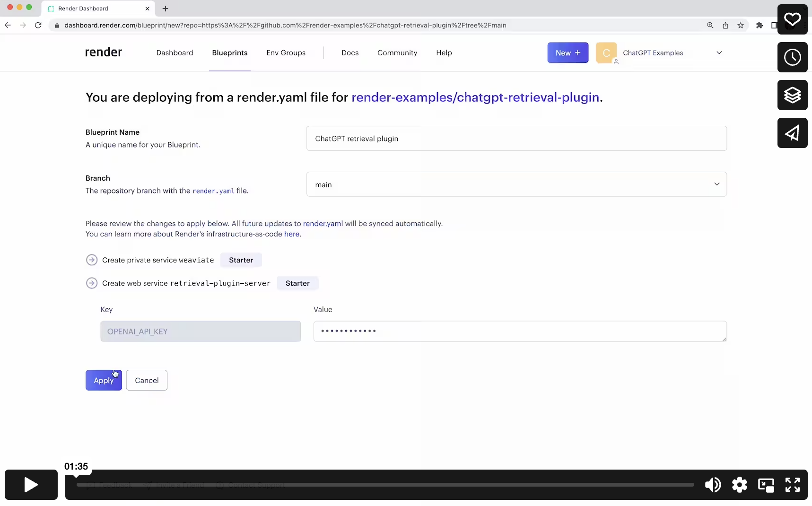

# Deploying to Render

## Removing Unused Dependencies

Before deploying your app, you might want to remove unused dependencies from your [pyproject.toml](/pyproject.toml) file to reduce the size of your app and improve its performance. Depending on the vector database provider you choose, you can remove the packages that are not needed for your specific provider.

Find the packages you can remove for each vector database provider [here](removing-unused-dependencies.md).

After removing the unnecessary packages from the `pyproject.toml` file, you don't need to run `poetry lock` and `poetry install` manually. The provided Dockerfile takes care of installing the required dependencies using the `requirements.txt` file generated by the `poetry export` command.

## Deployment

Render maintains a [fork](https://github.com/render-examples/chatgpt-retrieval-plugin/) of this repository with a few small changes that facilitate easy deployment. The source code is unchanged. To deploy both the Docker container from this repository and a self-hosted Weaviate database to back it, just click the button below. Enter your OpenAI API key when prompted.

The bearer token will be randomly generated for you. You can view it in in the "Environment" tab on the [Render dashboard](https://dashboard.render.com) page for your server. For more guidance, consult the [README in Render's fork](https://github.com/render-examples/chatgpt-retrieval-plugin/blob/main/README.md), [Render's documentation](https://render.com/docs), or the screen recording linked below.

